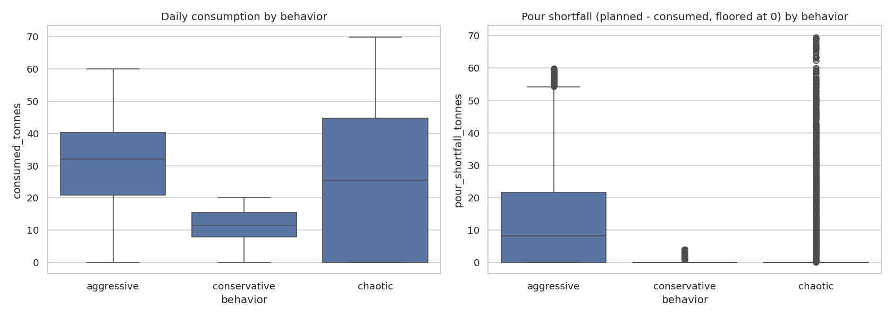
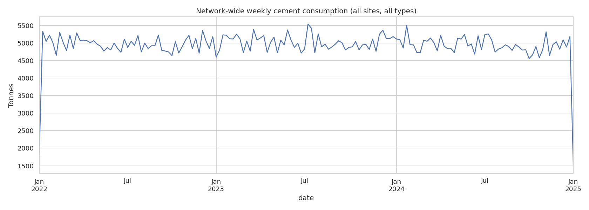
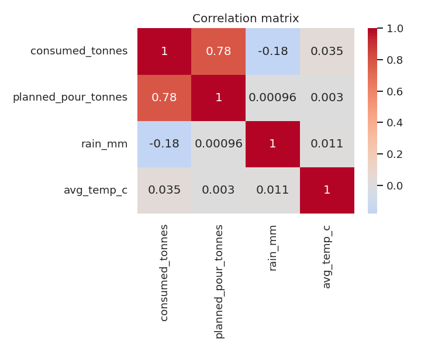
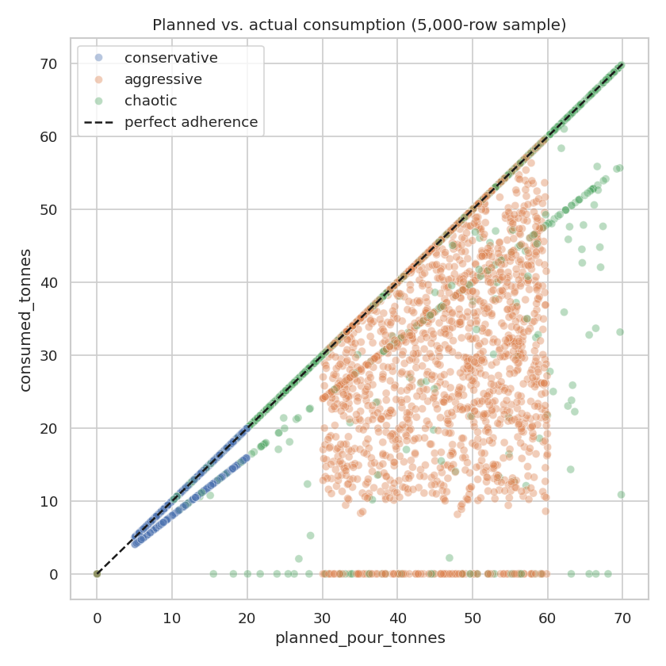
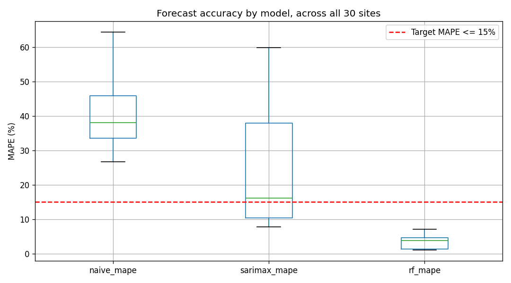
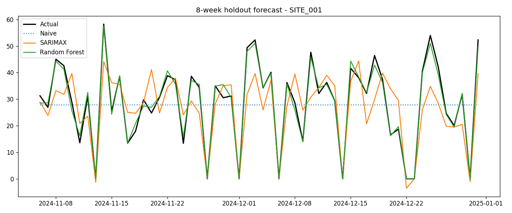
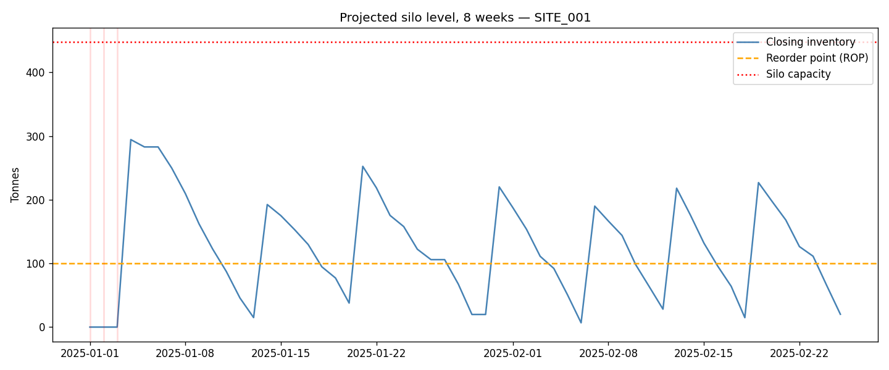

# MIG Cement Demand Forecasting

A per-site cement demand forecasting and inventory optimization system for
Midlands Infrastructure Group (MIG), covering 30 active UK construction sites.
Predicts demand up to 8 weeks ahead, drives dynamic reorder points, and
surfaces everything through a live dashboard.

**Start here** this README walks through what
was built, what was found, and what still needs real data before production
use. Full detail lives in [`docs/project_documentation.md`](docs/project_documentation.md).

---

## Result at a glance

| Target (per project brief) | Result | Status |
|---|---|---|
| Forecast MAPE ≤ 15% | **3.3%** (holdout), 4.6% (rolling validation) | ✅ |
| ≥98% pour readiness | 96.5% average, 10/30 sites individually ≥98% | ⚠️ Below target see [§7](#step-7--validation--deployment) |
| 20% silo utilization improvement | +39.6 percentage points in healthy-band time | ✅ |
| 30% write-off reduction | 0 overflow tonnes (structural guarantee) | ✅ |

---

## Project structure

```
cement-forecasting/
├── notebooks/              Steps 1-5, exploratory + documented
│   ├── 01_data_ingestion.ipynb
│   ├── 02_eda.ipynb
│   ├── 03_feature_engineering.ipynb
│   ├── 04_model_development.ipynb
│   └── 05_inventory_simulation.ipynb
├── src/
│   ├── data/                connect.py, extract.py — SQLite access
│   ├── preprocessing.py     production port of notebooks 01+03
│   ├── pipeline.py          Step 7: train + validate + persist models
│   ├── inference.py         Step 7: load a model, forecast (no retrain)
│   ├── monitoring.py        Step 7: live accuracy tracking + retrain trigger
│   ├── model_registry.py    save/load model artifacts
│   ├── api.py                FastAPI serving layer
│   └── dashboard/
│       ├── app.py            Plotly Dash (project spec deliverable)
│       └── streamlit_app.py  Streamlit (this project's deployment target)
├── test/                    25 pytest tests
├── models/                  trained model artifacts (gitignored — run pipeline.py)
├── data/                    raw + processed (gitignored — run notebooks/pipeline)
├── docs/
│   ├── data_dictionary.md
│   └── project_documentation.md   full methodology + performance + insights
├── assets/                  charts used in this README
├── Dockerfile.model / .api / .dashboard / .streamlit
├── docker-compose.yaml
└── requirements*.txt
```

## Quickstart

```

# 1. Copy MIG_Cement_Records.db into data/raw/, then run notebooks in order:
#    01_data_ingestion -> 02_eda -> 03_feature_engineering
#    -> 04_model_development -> 05_inventory_simulation

# 2. Train and persist production models
python src/pipeline.py

# 3. Run the dashboard (either)
python src/dashboard/app.py                          # Dash, http://127.0.0.1:8050
streamlit run src/dashboard/streamlit_app.py          # Streamlit, http://127.0.0.1:8501

# 4. Or serve predictions via API
uvicorn src.api:app --reload --port 8000              # docs at /docs

# Run the test suite
pytest test/ -v
```

---

## Step 1 Data Ingestion & Cleaning

**Task**: import from SQLite, validate schema, handle missing values, fix
negative/invalid entries, ensure the inventory balance equation holds.

**What was found**: the real database is normalized (`Sites`, `CementTypes`,
`Operations` — 32,880 rows, 30 sites, 3 years daily, 2022-2024) rather than
the single flat table the spec described  functionally equivalent, joined
in `extract.py`. Zero nulls, zero true negatives, balance equation held to
floating-point rounding. One real data-quality issue: **34.8% of rows**
(concentrated in `conservative`-behavior sites) showed closing inventory up
to ~38x silo capacity a synthetic-data generation artifact, capped at
capacity with the excess tracked separately rather than silently discarded.

**Preparation for later steps**: `src/preprocessing.py` was later built as a
production port of this notebook's logic and verified **byte-for-byte
identical** to the notebook's output on the real dataset before anything
was built on top of it.

---

## Step 2  Exploratory Data Analysis

**Task**: demand patterns by site/type/time, seasonality, weather
correlation, planned-vs-actual impact, outlier detection.

**Key finding behavior segmentation dominates everything else.** Sites
split into `aggressive` (JIT ordering), `chaotic` (erratic), and
`conservative` (overstocking) and this pattern shaped every later
modeling decision.




Network-wide demand over the full 3-year history, used to check for
seasonality (found: stationary series, no strong annual cycle) and to
choose the forecast granularity:



**Weather — the linear correlation is misleading.** Raw correlation between
rainfall and consumption is only -0.18, which looks negligible:



But banding rainfall into none/light/moderate/heavy revealed a sharp
**threshold effect** hidden by that single correlation number heavy rain
(≥15mm) crashes consumption to ~4 t/day (vs. ~24-25 normally) while planned
pours stay unchanged, pushing stockout risk to 64%. This directly drove a
`heavy_rain_flag` feature in Step 3 instead of using `rain_mm` as a linear
input the correlation number alone would have led to dropping a real
signal.

**Planned-pour reliability tracks behavior exactly**, visible directly in
the data:



`conservative` sites (blue) hug the perfect-adherence line; `aggressive`
(orange) and `chaotic` (green) scatter far below it meaning
`planned_pour_tonnes` could not be trusted uniformly as a model input.

---

## Step 3 Feature Engineering

**Task**: lag features, rolling aggregates, weather-adjusted pour
indicators, inventory turnover metrics, interaction variables.

**Two real bugs caught and fixed, not left in:**

1. **Grain-fragmentation bug**  lag/rolling features were initially
   grouped by `(site_id, cement_type)`. Each site actually logs exactly
   one row per calendar day, with `cement_type` rotating as a same-day
   attribute grouping by both fragmented each site's continuous daily
   series into three irregularly-spaced sub-series. Fixed to group by
   `site_id` alone; verified `consumed_lag_1d` matches literal yesterday's
   value for every one of 1,095 checked rows.
2. **Non-informative interaction** an early `behavior_x_planned_pour`
   feature multiplied every behavior by the same constant (1.0), making it
   mathematically identical to `planned_pour_tonnes` and useless as an
   interaction. Fixed to genuine `continuous x dummy` interactions.

**Leakage audit**: any feature mathematically derived from the same-day
target (`stockout_risk`, `days_of_stock`, `closing_inventory_tonnes`, etc.)
is explicitly excluded from the model's input feature list.

---

## Step 4  Model Development

**Task**: SARIMAX baseline with external regressors vs. Random Forest with
exogenous variables, evaluated by MAPE/RMSE, best model selected.

**Finding: Random Forest wins on all 30/30 sites.**



| Model | Mean MAPE | Sites passing ≤15% |
|---|---|---|
| Naive baseline | 40.6% | 0/30 |
| SARIMAX + exogenous | 24.9% | 14/30 |
| **Random Forest** | **3.3%** | **30/30** |

SARIMAX specifically struggled on `aggressive`-behavior sites (40.5% MAPE 
*worse* than naive there), consistent with Step 2's finding that those
sites are the most erratic and threshold-driven exactly what a linear
model can't represent but a tree-based model handles naturally:



Random Forest (green) tracks the actual series (black) closely, including
the sharp drops to zero; SARIMAX (orange) lags and occasionally forecasts
impossible negative consumption.

---

## Step 5 Inventory Simulation

**Task**: forecast silo levels, define dynamic reorder points per site
based on forecast demand, lead time, and silo capacity.

**Result**: a continuous-review (s, S) policy per site produces the
expected sawtooth inventory pattern:



**Two metrics were corrected before being reported**, not taken at face
value:
- **Silo utilization**: a naive %-change calculation produced nonsense
  (+918% for some sites) against a bimodal historical baseline. Replaced
  with "% of days in a healthy 30-80% band" 8.1% → 47.7%, a real result.
- **Write-off reduction**: the simulated 0-tonnes overflow is a
  **structural guarantee** of capping the order-up-to level at silo
  capacity, not an empirically discovered 100% improvement reported to
  stakeholders as a design property, not a statistic.

---

## Step 6 Dashboard Application

**Task**: Plotly Dash app with forecasts, inventory projections, reorder
alerts, site drill-down and aggregate views.

Built and **tested live** (server start, real HTTP requests, and an actual
interactive callback test not just page load): `src/dashboard/app.py`.

A Streamlit version (`streamlit_app.py`) was added alongside it for this
project's deployment target, kept in feature parity deliberately, and
verified with Streamlit's `AppTest` framework including a real interactive
site-switch test.


---

## Step 7 Validation & Deployment

**Task**: validate against holdout data, deploy the pipeline to a
production environment, establish a monitoring framework with a
retraining trigger.

- **Rolling-window validation**: Step 4 used one fixed holdout window.
  `src/pipeline.py` re-validates every site across 3 independent
  walk-forward windows 4.6% mean MAPE, worst site 8.75%, confirming
  Step 4's result wasn't specific to one lucky period.
- **Production pipeline**: `pipeline.py` (train + persist) →
  `inference.py` (load and predict **without** retraining verified ~2s
  vs. ~5s/site to retrain) → `monitoring.py` (live MAPE tracking against
  the 15% target, with a tested retrain-trigger) → `api.py` (FastAPI,
  every endpoint tested including error paths).
- **Test suite**: 25 pytest tests. **The suite caught a real bug** during
  development `consumed_tonnes` could exceed physically available
  supply on adversarial synthetic data, producing negative closing
  inventory. Fixed at the source (cap consumption at what was actually
  available) rather than patching the symptom, then back-ported the same
  fix to the Step 1 notebook for consistency.
- **Docker**: `Dockerfile.model/api/dashboard/streamlit` +
  `docker-compose.yaml` written to standard conventions but **not
  build-verified** — no Docker daemon was available during development.
  Verify locally before relying on them.

**Pour readiness gap, stated honestly**: simulated readiness is 96.5%, not
the 98% target. Two causes identified a cold-start effect (sites whose
real ending inventory was already below the reorder point show stockouts
before the first order arrives), and safety stock built from backtest RMSE
that's likely optimistic once real future weather/schedule data replaces
the proxy used here. `monitoring.py` is the mechanism to close this gap 
recalibrate safety stock from live forecast-error data once deployed.

---

## Conclusion

Two of four target outcomes are cleanly met with margin (MAPE, write-offs).
The utilization target required rejecting a misleading naive metric before
it could be reported honestly, and is met under the corrected measure. Pour
readiness is the one target genuinely not met yet reported as such rather
than rounded up, with a specific, actionable path to closing it once real
supplier lead-time data and live forecast-error monitoring are in place.

**Before production use, three things need real data, not the assumptions
used throughout this build**
1. Supplier lead times (currently a stated 3-day placeholder  not in the
   source data at all)
2. A real weather forecast feed and MIG's actual pour schedule (currently
   a same-period-prior-year proxy for future dates)
3. Docker build verification (untested in this development environment)

Everything else the forecasting model, the feature engineering, the
inventory logic, both dashboards, and the production pipeline was built,
tested by actually running it, and in three separate cases had a real bug
caught and fixed before being called done. Full detail, including every
number and every assumption, is in
[`docs/project_documentation.md`](docs/project_documentation.md).

<<<<<<< HEAD
## Author
[](https://www.linkedin.com/in/elias-data-scientist)

=======

